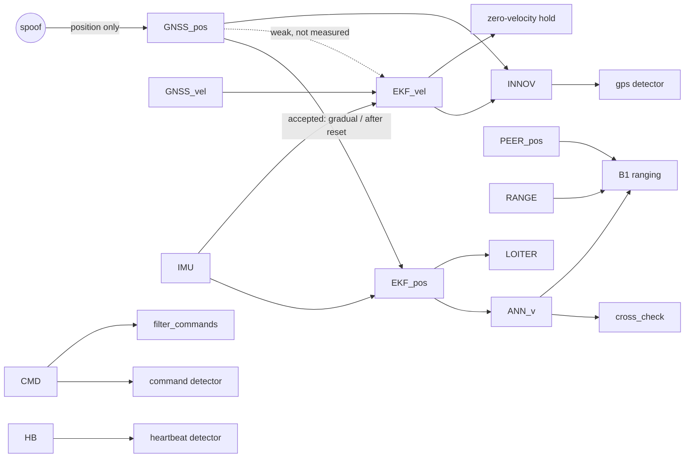

# Data-dependency graph: A/B/C x attack scenarios (review stage 5, step 1)

Status: written 2026-09-27, before any B1 code or flight. Sections 1-4 are
built from the code (commit 56678bd) and checked against results that
already exist (v1, H2, B0). Because the graph was drawn after those
results, agreement with them is a consistency check, not a test. Only the
B1 predictions in section 5 are tests; H3_PREREGISTRATION.md will fix
them in their final numeric form.

Question through the thesis: which data can each stage of the
self-healing loop (detect -> isolate/announce -> recover) trust?

Attack model: position-only GNSS spoof of a single victim (uav_0).
GZBridge patch `OFFSET_INJECT`, lat/lon only; GNSS velocity stays true.
Command injection uses a sysid outside the whitelist. The attacker does
not control radio ranging (B1).

## 1. Data sources (nodes)

| id | data | produced | reaches the defence via | used by |
|---|---|---|---|---|
| GNSS_pos | GNSS position (GPS_RAW_INT lat/lon) | victim receiver (GZBridge navsat, 30 Hz) | victim FC | EKF2; gps detector (through the innovation) |
| GNSS_vel | GNSS velocity | victim receiver | victim FC | EKF2 only |
| IMU | accelerometer and gyro | victim FC (Gazebo physics) | inside EKF2 | EKF2 prediction |
| EKF_pos | EKF2 position estimate (LOCAL_POSITION_NED, GLOBAL_POSITION_INT) | victim FC | MAVLink -> victim's monitor | LOITER (mode_loiter); mesh announcement |
| EKF_vel | EKF2 velocity estimate | victim FC | inside PX4 | OFFBOARD velocity loop (hold_zero_velocity) |
| INNOV | pos_horiz_ratio (ESTIMATOR_STATUS, 1 Hz) = GNSS_pos vs the prediction from IMU + EKF_vel | victim FC | MAVLink | gps detector |
| HB | HEARTBEAT, 1 Hz | victim FC | telemetry link -> monitor | heartbeat detector |
| CMD | incoming COMMAND_LONG/INT + source sysid | external sender | victim's router endpoint | command detector; filter_commands |
| ANN_v | victim's mesh announcement = EKF_pos of the victim (from GLOBAL_POSITION_INT) | **victim's monitor** (victim's failure domain) | ZeroMQ mesh (C only) | cross_check on peers |
| PEER_pos | each peer's own EKF_pos | peer FCs | peer's own monitor | B1 (not in v1) |
| RANGE | inter-UAV range (B1: Gazebo truth + UWB model) | radio physics between peer and victim | measured on the peer | B1 (not in v1) |

Taint under the position-only spoof: GNSS_pos is always tainted.
EKF_pos and ANN_v are tainted once EKF2 accepts the spoof: continuously
at slow rates, and in one reset jump at ~7.5 s at fast rates (B0). INNOV
carries the taint only while EKF2 rejects the spoof. EKF_vel is clean
under this model (evidence: H2). A weak coupling through the
position-velocity covariance at slow rates is possible but not measured
(section 5, P-B1-8). IMU, GNSS_vel, PEER_pos and RANGE do not depend on
the victim's navigation.

## 2. Detectors as comparisons

A detector compares two data items. It can fire only when the two sides
diverge. It is independent of the victim only if one side does not
depend on the victim.

| detector | compares | sides depend on victim? | fires when | runs in (A / B / C) |
|---|---|---|---|---|
| gps | GNSS_pos vs EKF prediction (INNOV > 1, k = 3 samples at 1 Hz) | both | EKF2 **rejects** the spoof | GS (shared) / victim / victim |
| cross_check | ANN_v(t) vs ANN_v(t - dt): jump > 25 m/s * dt + 10 m | both (same stream, two instants) | EKF_pos **jumps** (reset) by more than ~35 m | - / - / peers |
| command | CMD sysid vs whitelist {1,2,3,255} | CMD is the attacked channel, the whitelist is not | sysid is foreign | GS / victim / victim |
| heartbeat | HB arrival vs 3 s timeout | channel availability only | the link is silent | GS / victim / victim |
| B1 ranging (planned) | range implied by ANN_v and PEER_pos vs RANGE | **one side independent** (RANGE, PEER_pos) | EKF_pos diverges from truth along the line of sight by more than the threshold theta | - / - / peers |

The three spoof detectors cover three EKF2 regimes. gps sees a spoof
that EKF2 rejects, cross_check sees a spoof that EKF2 takes in one jump,
and only B1 sees a spoof that EKF2 has accepted smoothly.

Which data each architecture keeps independent of the victim:

| architecture | data independent of the victim | detection outside the victim's failure domain |
|---|---|---|
| A | none | no: the GS domain is shared by all monitors |
| B | none | no (only its own domain) |
| C (v1) | none: cross_check reads the victim's own announcements | yes (peers), but ANN_v is published from the victim's domain |
| C + B1 | RANGE, PEER_pos | yes (peers); still needs ANN_v from the victim's domain |

In v1, A/B/C differ in *where* detection runs, not in *what data* it
uses. B1 is the first configuration that changes the data.

## 3. Recovery actions and the data they rely on

| action (policy) | relies on | effective when | fails when |
|---|---|---|---|
| mode_loiter (proportionate) | EKF_pos: holds the estimated point | EKF_pos is untainted **after** the action | EKF_pos becomes tainted after the action starts (LOITER before the jump) |
| hold_zero_velocity (trust_aware) | EKF_vel (OFFBOARD body velocity 0) | EKF_vel is clean: a position-only spoof | the spoof falsifies GNSS velocity consistently (outside the model); open at slow rates (P-B1-8) |
| filter_commands | CMD sysid at the victim's router | the attacker's sysid is not whitelisted | forged sysid: detection and action fail together (P7, no MAVLink signing) |
| none (heartbeat_loss, all policies) | - | vehicle data are intact; only the observation channel is lost | - (a destructive action here harms without cause; pass-1 number is audit-blocked, not cited) |

**The zero-velocity hold is not independent of the victim.** It uses
EKF_vel, the victim's own estimate. It is valid only because this attack
leaves GNSS_vel and IMU intact. Row 5 of table 4.12 (consistent spoof of
position and velocity) is where this assumption breaks.

## 4. Scenario x architecture: graph prediction vs existing results

Legend: ok = consistent; - = not flown; post hoc = drawn after the data.
Detection is k/n valid runs (table 4.2). Drift is the median
post-response drift of the victim, m.

| # | scenario | tainted data | graph: detection A / B / C | observed A / B / C | graph: action (C) | observed | |
|---|---|---|---|---|---|---|---|
| 1 | GPS 30 m/s (campaign) | GNSS_pos; EKF_pos, ANN_v from the jump at ~7.5 s | gps in all three (EKF rejects for ~7.5 s); C also cc at the jump | 14/15, 15/15, 14/15; B0 L30: gps 2.6 s, cc 7.7 s | LOITER at ~2.9 s, before the jump -> drift ~ jump ~ 50 m; zero-velocity hold -> small | LOITER 49.95 m (n=14); H2 1.53 vs 50.13 m | ok |
| 2 | GPS 10 m/s (B0 L10) | as 1; jump 39 m | gps; cc at the jump (39 > 35 m budget) | gps 3.7 s, cc 7.7 s | not flown: LOITER ~50 m, zero-velocity hold small | - | ok (detection) |
| 3 | GPS 3 m/s (B0 L3) | GNSS_pos; partial absorption before the jump (harm 4 m at 5.7 s); jump 19 m | gps only; cc silent (19 < 35 m) | gps 5.7 s, cc - | not flown | - | ok, post hoc (L3 not predicted in the B0 prereg) |
| 4 | GPS 1 m/s (B0 L1) | GNSS_pos -> EKF_pos smoothly, no rejection, no jump | nothing fires anywhere | nothing; 48 m off route without alarm | no alarm, so no action | - | ok (pre-registered) |
| 5 | detector takeout + GPS 30 | local detectors off; as 1 | A 0, B 0 (their only path is local), C cc at the jump | 0/28, 0/30, 30/30; cc at 7.44 s | LOITER **after** the jump holds the shifted point -> small drift | LOITER 8.22 m; zero-velocity hold 3.70 m (descriptive) | ok |
| 6 | monitor takeout (neighbour's domain) + GPS 30 | the GS domain in A / uav_1's domain in B, C; as 1 | A 0 (shared domain), B gps, C gps + cc | 0/28, 29/30, 30/30 | as 1 | LOITER 49.98 m; H2 1.44 vs 50.12 m | ok |
| 7 | command injection (foreign sysid) | CMD only; EKF_pos and EKF_vel clean | command detector in all three | 15/15 each | filter_commands relies on CMD sysid -> full mission (C); A, B have no action | full mission 13/15 (C) vs 0/15 (A, B) | ok |
| 8 | comm disruption (UDP drop at the monitor) | availability of HB/telemetry; vehicle data intact | heartbeat in all three | 15/15, 15/15, 13/13 | no action by policy -> no A/B/C difference | mission execution 0.43 equal for A, B, C | ok (the graph predicts no difference; it does not explain the level 0.43) |

Derived predictions for cells not flown (v1 detectors):

- 5' detector takeout + GPS at 3 or 1 m/s: C loses its only path (cc
  silent below the 35 m budget), so A = B = C = 0.
  **C's H1 advantage exists only for fast spoofs.** This is the P6 limit,
  now stated as a prediction.
- 6' monitor takeout of the **victim's own** domain: local detectors die
  and ANN_v stops, because it is published from the victim's monitor. cc
  goes blind and A = B = C = 0. This matches the monitor_takeout
  docstring; it was not flown.

## 5. Predictions for B1 (fixed before the detector exists)

Notation: e(t) = |EKF_pos - truth| of the victim (B0: nav error).
e_LOS,i = projection of the divergence onto the line of sight to peer i.
theta = alarm threshold, set in H3 from the noise model. Sustain rule as
in H3.

- **P-B1-1 (closes the blind zone).** At 1 m/s the ranging detector
  fires at t ~ first time max_i |e_LOS,i| > theta, plus the sustain
  time. Detection is driven by accumulated divergence, not by spoof rate.
  harm_at_alarm ~ theta / max_i |cos phi_i| (m), not ~48 m. H3 will
  compute the numbers from the B0 L1 nav-error series and the flown
  geometry, before flights.
- **P-B1-2 (no gain before the EKF reset).** At 30 and 10 m/s EKF_pos ~
  truth until the reset (B0 harm_at_alarm 0.4-0.6 m), so ranging fires
  at the reset (~7.5 s + sustain), after gps (2.6 / 3.7 s). Ranging and
  gps are complementary, not redundant: each sees a regime the other
  misses. At 3 m/s ranging can precede the jump only if theta < ~4 m
  (partial absorption, harm 4.3 m at 5.7 s).
- **P-B1-3 (survives detector takeout at all rates).** B1 runs in the
  peers' domains, so C + B1 detects detector takeout at 3 and 1 m/s,
  where cc is silent (cells 5'). This gives mesh a role that B cannot
  replicate, independent of spoof rate.
- **P-B1-4 (still depends on the victim's publisher).** If the victim's
  own monitor is taken out, ANN_v stops and B1 is blind, like cc (cell
  6'). B1 changes the data, not this dependency.
- **P-B1-5 (geometry).** A divergence perpendicular to every line of
  sight is invisible to first order. With 2 peers not collinear with the
  victim, the plane is covered, but the delay depends on the spoof
  direction relative to the formation. Flights use one direction
  (north), which is a stated limit.
  [2b] With the 5 m altitude layers, the peers are almost above the
  victim at the injection phase (horizontal 1–4 m, vertical 5 / 10 m), so
  a horizontal divergence is second order until the formation opens up.
  North and east spoofs then give the same predicted harm (5.8 m at
  1 m/s). Vertical separation, used against collisions, costs horizontal
  sensitivity (H3_PREREGISTRATION.md).
- **P-B1-6 (noise floor sets the boundary).** theta must exceed the
  combined noise: UWB sigma 0.1 m + bias 0-0.4 m + peers' GNSS noise in
  PEER_pos (0.5 / 1.5 / 3 m in the offline map) + the victim's nominal
  error. The coverage boundary is therefore a displacement, not a speed.
  The offline map "speed x sigma_GNSS" should show a detection time of
  ~theta / v0 and a flat harm_at_alarm.
- **P-B1-7 (rigid whole-swarm spoof).** If all EKF_pos shift equally,
  relative geometry is intact and B1 is blind (Park & Yoo). Chapter 5,
  "cost of attack".
- **P-B1-8 (the recovery stage still matters after a B1 alarm).** At
  1 m/s the spoof keeps growing after the alarm. LOITER holds EKF_pos and
  loses the remaining offset: predicted drift ~ A - e(t_alarm), about
  45 m of 50. The zero-velocity hold relies on EKF_vel. If EKF2 fuses
  GNSS velocity strongly, EKF_vel ~ true velocity and the hold is small.
  This is not measured: B0 did not log vx/vy. Check it in the B1 flights
  by adding LOCAL_POSITION_NED vx, vy to the logged fields (an additive
  change). Secondary prediction for H3: creep speed under the hold is
  much less than v0.

Taken together, detection and recovery both need data independent of the
compromised node. B1 addresses detection (RANGE). The zero-velocity hold
addresses recovery only conditionally (EKF_vel is the victim's own data,
clean under the stated model).

## 6. Use in the thesis

- Ch. 3: operational definition of CSMA (which data are independent and
  where the check runs), adversary model (position-only; ranging not
  controlled; single victim), figure: the graph of section 1.
- Table 4.12: add a "detection source" column (which detector, which
  sides independent) and a B1 row after H3.
- Ch. 5: cells 5' and 6', P-B1-4, P-B1-7, and the EKF_vel assumption.
