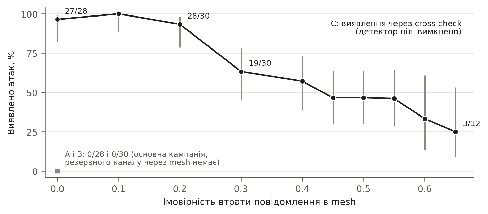
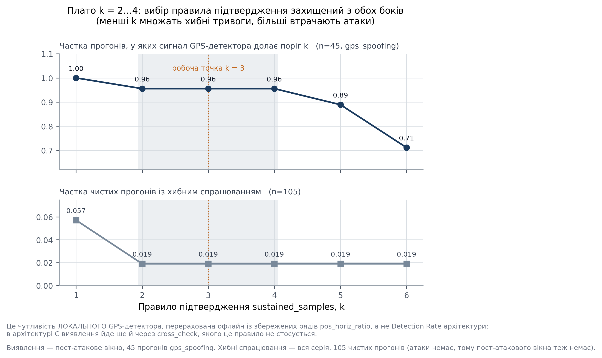
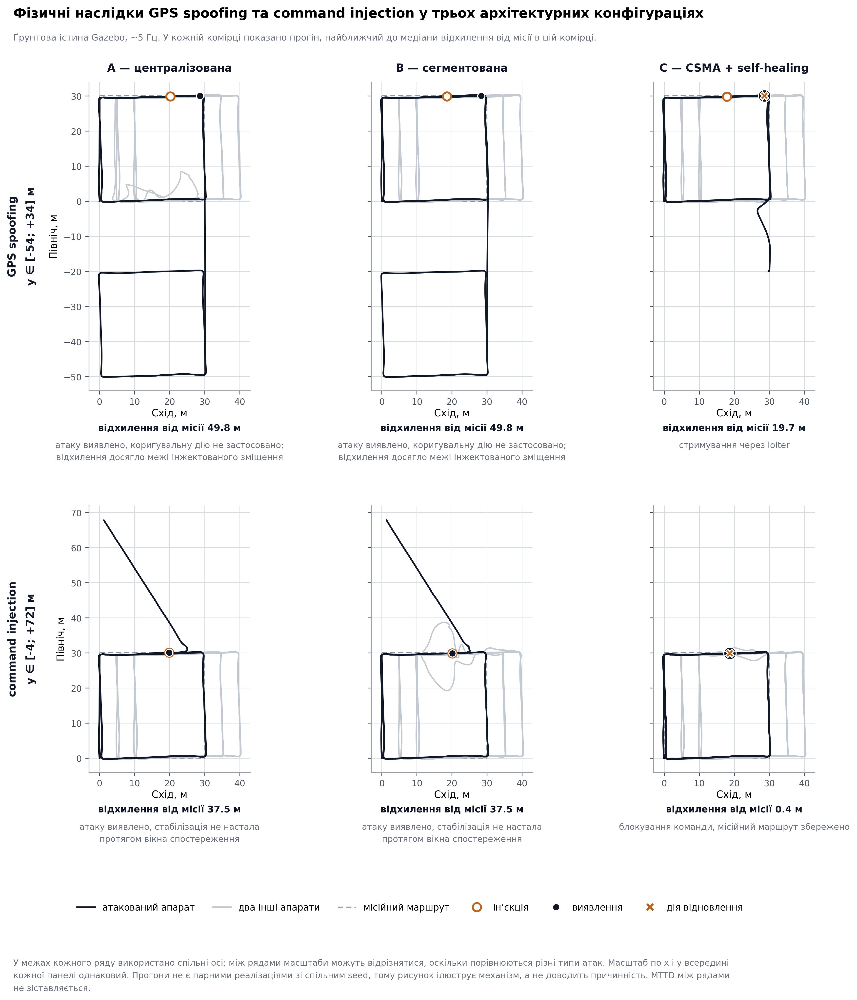
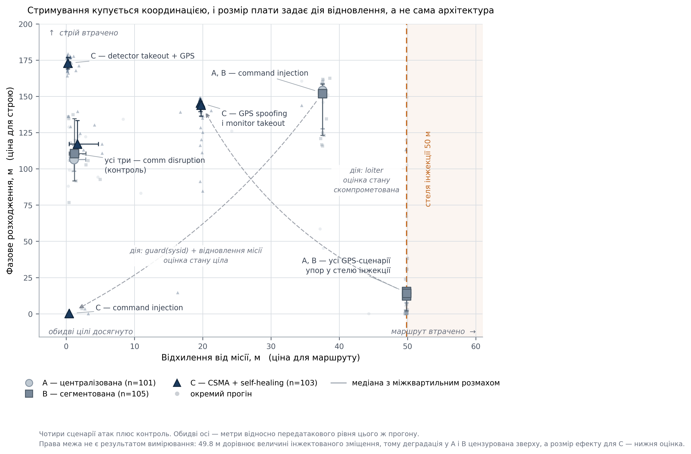

# РОЗДІЛ 4

# Експериментальні результати оцінювання архітектурних конфігурацій кіберзахисту рою БПЛА

## 4.1. Корпус експериментальних даних і логіка аналізу

Експериментальне порівняння трьох повних архітектурних конфігурацій A, B і C виявило спільну закономірність: стійкість системи була пов'язана з тим, яка інформація про атаку зберігалася, який канал виявлення залишався працездатним і яку дію реагування можна було безпечно виконати. У стандартних сценаріях доступної інформації було достатньо для високої повноти виявлення в усіх трьох конфігураціях. Архітектурні відмінності ставали виразними за компрометації площини безпеки або командного каналу. Вони проявлялися у повноті виявлення, фізичному рівні стабілізації та збереженні координації.

Авторитетний master-файл містить 435 записів. Із них 20 спроб завершилися помилкою, а один експериментальний прогін був виключений за правилом `attack_did_not_land`. Валідний корпус становив 414 прогонів: 136 для A, 140 для B і 138 для C. До основного корпусу з атаками увійшли 309 прогонів, відповідно 101, 105 і 103 для A, B і C. Ще 105 прогонів були валідними польотами без атаки, по 35 для кожної архітектури. Потік формування корпусу та умови включення для окремих метрик наведено в табл. 4.1.

Умови включення визначалися відповідно до фізичного змісту метрики. Detection Rate, тобто повнота виявлення, обчислювалася у межах окремих комірок `architecture × attack`. Conditional MTTD, тобто умовний час до виявлення, визначався лише серед прогонів, у яких атаку було виявлено. Time to Isolation характеризував час до програмної команди ізоляції та був наявний для 220 реакцій на атаку. Total Response Time, або загальний час реагування, був наявний для 88 прогонів конфігурації C з подіями відновлення. Контрольна сукупність для координації за відсутності атаки охоплювала 103 прогони з двома наявними метриками координації. Частку прогонів із хибними спрацюваннями оцінювали окремо для 105 польотів без атаки та 414 вікон спостереження без атаки. Отже, кожен результат характеризує власну сукупність і не є складовою зведеного рейтингу архітектур.

Основне дослідницьке припущення полягало в тому, що незалежний канал виявлення дає змогу зберегти повноту виявлення після компрометації основного компонента безпеки. Його оцінено за чотирма заздалегідь визначеними контрастами C–A і C–B у двох takeout-сценаріях із точним критерієм Фішера, довірчим інтервалом Newcombe та поправкою Holm. Для часток наведено 95% довірчі інтервали Wilson. Порівняння медіан виконано за допомогою критерію Манна–Вітні або bootstrap зі зафіксованим seed відповідно до плану аналізу.

## 4.2. Виявлення атак і чутливість каналів виявлення

### 4.2.1. Повнота виявлення у стандартних сценаріях

У стандартних сценаріях GPS spoofing, comm disruption і command injection усі три конфігурації забезпечили високу повноту виявлення (табл. 4.2). Для GPS spoofing було виявлено 14 із 15 прогонів у A, 15 із 15 у B та 14 із 15 у C. Відповідні 95% довірчі інтервали Wilson становили 0.702–0.988 для A і C та 0.796–1.000 для B. Порівняння C–A за точним критерієм Фішера дало p=1.000.

Для comm disruption атаку було виявлено в усіх 15 із 15 прогонів A і B та 13 із 13 валідних прогонів C. Для command injection кожна архітектура мала 15 виявлень із 15. Коли первинні спостереження і штатні канали виявлення зберігалися, архітектурні відмінності за повнотою виявлення були мінімальними. Нижні межі інтервалів Wilson залишалися нижчими за 1, тому повні досліджені комірки характеризують наявну вибірку, а не гарантований результат поза нею.

### 4.2.2. Збереження повноти виявлення за компрометації площини безпеки

Архітектурні відмінності проявилися тоді, коли атака безпосередньо порушувала площину безпеки. У сценарії `detector_takeout+gps_spoofing` конфігурації A і B не мали атрибутованих після атаки подій виявлення у валідних прогонах: 0/28 і 0/30 відповідно. Конфігурація C мала 30/30 виявлень. 95% довірчі інтервали Wilson становили 0–0.121 для A, 0–0.114 для B і 0.886–1.000 для C. У повній конфігурації C канал `cross_check` зберігав інформацію, потрібну для виявлення, після втрати локального детектора.

Обидва заздалегідь визначені контрасти в комірці detector takeout підтвердили цю відмінність. Для C–A різниця часток дорівнювала +1.000, а 95% довірчий інтервал Newcombe становив +0.834…+1.000. Точний критерій Фішера дав p=3.44e-17, скориговане за Holm значення становило p=1.03e-16. Для C–B різниця також дорівнювала +1.000, довірчий інтервал становив +0.839…+1.000, p=1.69e-17, а скориговане значення p=6.76e-17. Науковий зміст результату полягає у збереженні повноти виявлення за наявності іншого доступного каналу отримання інформації. Контраст стосується повних комплексних конфігурацій, у яких компоненти не варіювалися окремо.

У `monitor_takeout+gps_spoofing` конфігурація A мала 0/28 виявлень, B мала 29/30, а C мала 30/30. Інтервал Wilson для A становив 0–0.121, для B становив 0.833–0.994, для C становив 0.886–1.000. Контраст C–A дав різницю +1.000 із довірчим інтервалом Newcombe +0.834…+1.000 і скоригованим за Holm значенням p=1.03e-16. Спільний домен моніторингу став єдиною точкою відмови для A. Розділення каналів моніторингу в B та незалежний канал у C узгоджувалися зі збереженням повноти виявлення.

Контраст C–B у комірці monitor takeout залишився нульовим результатом. Різниця дорівнювала +0.033, довірчий інтервал Newcombe охоплював нуль (−0.083…+0.167), а значення p за точним критерієм Фішера та після поправки Holm дорівнювали 1.000. Обидві конфігурації зберегли працездатний канал виявлення, і перевагу однієї з них у цьому сценарії не встановлено. Додаткове порівняння B–A дало p=2.00e-15.

Основне дослідницьке припущення підтримано частково. Конфігурація C зберегла повноту виявлення порівняно з A в обох takeout-сценаріях і порівняно з B при detector takeout. Конфігурації B і C обидві зберегли виявлення при monitor takeout. Наявність незалежного каналу отримання інформації узгоджувалася зі збереженням повноти виявлення у цих сценаріях.

### 4.2.3. Умовний MTTD

Повнота і швидкість виявлення характеризували різні властивості системи. Умовний MTTD аналізували лише серед прогонів, у яких атаку було виявлено. Для комірок без виявлень MTTD не визначений.

У GPS spoofing медіана MTTD становила 2.860 s [2.745, 2.947] для A (n=14), 2.945 s [2.842, 3.003] для B (n=15) і 2.939 s [2.867, 2.978] для C (n=14). Порівняння за критерієм Манна–Вітні дали p=0.370 для C–A і p=0.678 для C–B. У комірці monitor takeout медіана MTTD дорівнювала 2.865 s [2.815, 2.977] для B (n=29) і 2.905 s [2.803, 2.975] для C (n=30). Порівняння C–B дало p=0.826. За працездатного каналу виявлення розподіли часу були близькими.

У сценарії detector takeout MTTD був визначений лише для C і становив 7.429 s [7.337, 8.208] при n=30. Виявлення через `cross_check` здійснювалося іншим каналом, ніж виявлення локальним GPS-детектором із часом близько 2.9 s. Архітектурна відмінність стосується насамперед можливості виявити атаку після компрометації. Пряме порівняння швидкості різних каналів не має спільної оцінюваної величини.

### 4.2.4. Чутливість до втрат у mesh та параметра sustain

Рис. 4.1 показує зміну повноти виявлення C/`cross_check` зі зростанням втрат повідомлень у mesh. За mesh loss 0.00 виявлення відбулося у 27/28 прогонів, за 0.10 у 29/29, за 0.20 у 28/30. Далі точкова оцінка загалом знижувалася: 19/30 за 0.30, 16/28 за 0.40 і близько 0.46 у діапазоні 0.45–0.55. За loss 0.65 було виявлено 3/12 прогонів із широким інтервалом Wilson 0.089–0.532.

**Рисунок 4.1. Чутливість C/`cross_check` до mesh loss**

Загальна спадна тенденція показує зв'язок між збереженням повноти виявлення та доступністю інформації від інших вузлів. Послідовність точкових оцінок не була строго монотонною, формальний тест тенденції не виконувався, а два найвищі рівні втрат мали n=12. Значення 0.30 розглядається як область помітного зниження повноти виявлення, а не як статистично встановлений критичний поріг. Медіани умовного MTTD за рівнями наведено в допоміжній таблиці до рис. 4.1.

Другий аналіз чутливості стосувався локального GPS-детектора (рис. 4.2). За sustain k=1 локальний сигнал спостерігався у 45/45 прогонів з GPS-атакою, але позитивні FP-прогони без атаки виникли у 6/105 випадків. За k=2, k=3 і k=4 результати утворили плато: 43/45 виявлень і 2/105 FP-прогонів без атаки для кожного значення. За k=5 і k=6 кількість виявлень знизилася до 40/45 і 32/45 відповідно, тоді як кількість FP-прогонів без атаки залишилася на рівні 2/105.

**Рисунок 4.2. Offline-аналіз чутливості локального GPS-детектора до sustain k**

Використане в основній кампанії значення k=3 розташоване на спостережуваному плато k=2–4 і має те саме співвідношення результатів, що й сусідні значення параметра. Значення k=1 підвищувало кількість виявлень за локальним сигналом до 45/45, але одночасно збільшувало кількість FP-прогонів без атаки до 6/105. Цей аналіз чутливості характеризує внутрішнє правило локального сигналу, а не Detection Rate цілої архітектури.

## 4.3. Стримування наслідків і часові характеристики ланцюга реагування

### 4.3.1. Containment Success, або успішність стримування

За визначенням глави 3, Containment Success вказує, чи поширилися наслідки атаки на нецільові UAV. У всьому корпусі валідних прогонів з атаками успішне стримування спостерігалося у 295/309 прогонів, тобто 0.955 із 95% довірчим інтервалом Wilson 0.925–0.973. За архітектурами значення становили 94/101 для A (0.931; 0.864–0.966), 101/105 для B (0.962; 0.906–0.985) та 100/103 для C (0.971; 0.918–0.990).

Близькі оцінки для трьох конфігурацій показують, що в більшості валідних прогонів поширення наслідків за межі цільового UAV було обмежене попри виразні відмінності у виявленні за takeout-сценаріїв. Containment Success відображає кінцевий системний результат усього ланцюга реагування, а не роботу лише механізму ізоляції.

### 4.3.2. Time to Isolation та Total Response Time

Time to Isolation була наявна для 220 реакцій на атаку після виключення двох базових рядків із FP. Загальна медіана становила 51.856 μs, діапазон становив 36.240–548.363 μs. Медіани для конфігурацій були близькими: 52.810 μs для A (n=44), 51.379 μs для B (n=74) і 51.618 μs для C (n=102). Локальна програмна команда ізоляції виконувалася за десятки мікросекунд, а практично значущого розділення між архітектурами не спостерігалося.

Метрика вимірює вузький інтервал усередині програмного ланцюга подій, а не час фізичного стримування. Для аналізу реакцій на атаку її знаменник дорівнює 220. Два додаткові непорожні рядки у повному master-файлі належать базовим хибним спрацюванням.

Total Response Time характеризувала повніший ланцюг подій у прогонах конфігурації C з подіями відновлення. Серед 88 придатних прогонів медіана становила 7.431 s, діапазон становив 0.016–8.354 s. Медіани за сценаріями дорівнювали 0.029 s для command injection (n=14), 7.441 s для detector takeout (n=30), 7.427 s для GPS spoofing (n=14) і 7.457 s для monitor takeout (n=30). Ця умовна метрика відображає різницю між короткою реакцією на блокування командного каналу та ланцюгами реагування у GPS-сценаріях тривалістю близько семи секунд. Її сукупність охоплює лише конфігурацію C.

## 4.4. Відновлення та фізичні наслідки атак

### 4.4.1. Command injection

У сценарії command injection зростання відхилення від плану припинилося в інтервалі спостереження у 14/15 прогонів конфігурації C. 95% довірчий інтервал Wilson становив 0.702–0.988. Для A і B стабілізацію не було виявлено в жодному з 15 прогонів кожної конфігурації. Для 0/15 інтервал Wilson становив 0–0.204. Серед 14 стабілізованих прогонів C медіана MTTR functional, тобто функціонального часу відновлення, дорівнювала 0.119 s [0.075, 0.169]. Водночас Containment Success у C становила 13/15, що демонструє відмінність між результатами відновлення і стримування.

Науковий зміст цього контрасту полягає в тому, що збережена інформація про стан командного каналу узгоджувалася з можливістю заблокувати небезпечну команду і перейти до стабілізуючої дії реагування у повній конфігурації C. Recovery Success, тобто успішність стабілізації, у цій метриці означає припинення зростання відхилення від плану в межах інтервалу спостереження, а не повне відновлення місії. Внесок окремої дії не відокремлений від інших компонентів комплексної конфігурації.

### 4.4.2. Відновлення за spoofing-сценаріїв

За GPS-пов'язаних атак Recovery Success була високою в усіх трьох конфігураціях. У GPS spoofing вона становила 12/15 для A та 15/15 для B і C. У сценарії detector takeout показники дорівнювали 26/28, 28/30 і 30/30. У monitor takeout вони становили 27/28, 29/30 і 30/30. Розподіл функціонального часу відновлення та Stabilisation Level, тобто рівня стабілізації, показав, що близькі бінарні результати відповідали різним фізичним режимам стабілізації.

Для GPS spoofing медіана функціонального часу відновлення становила 51.000 s у A, 50.868 s у B і 16.356 s у C. Медіана рівня стабілізації дорівнювала відповідно 49.153, 49.137 і 19.601 m. У сценарії monitor takeout медіани функціонального часу відновлення становили 53.913, 51.353 і 16.373 s, а рівні стабілізації становили 49.142, 49.147 і 19.655 m. У A і B бінарне відновлення часто наставало після припинення подальшого зростання відхилення поблизу межі injected offset, а не після повернення до маршруту.

Найконтрастніший профіль спостерігався при detector takeout. Медіана функціонального часу відновлення становила 54.210 s для A, 54.123 s для B і 0.131 s для C. Відповідні рівні стабілізації дорівнювали 49.124, 49.127 і −0.174 m. Останнє значення є різницею відносно базового рівня, а не фізичною «від'ємною відстанню». Поєднання незалежного каналу виявлення та доступної дії реагування у конфігурації C узгоджувалося з істотно ранішою стабілізацією на нижчому рівні відхилення. Recovery Success залишається показником припинення зростання, тому його слід читати разом із функціональним часом відновлення, рівнем стабілізації та Mission Degradation.

### 4.4.3. Mission Degradation і залишкова функціональність

Mission Degradation, тобто деградація маршруту, безпосередньо характеризує спостережуване відхилення відносно базового рівня до атаки. У GPS spoofing медіана деградації була близькою до заданої межі 49.8 m для A і B та становила відповідно 49.837 і 49.834 m. Для C вона дорівнювала 19.665 m. У command injection відповідні медіани становили 37.531, 37.547 і 0.414 m. При detector takeout вони дорівнювали 49.843, 49.842 і 0.240 m, а при monitor takeout становили 49.888, 49.883 і 19.747 m. Bootstrap-інтервали зі зафіксованим seed для C–A і C–B у цих чотирьох сценаріях виключали нуль. Доступне поєднання каналів отримання інформації, виявлення та реагування у C було пов'язане з меншою деградацією маршруту в чотирьох із п'яти сценаріїв.

Comm disruption дав окремий нульовий результат. Медіани становили 1.123 m для A, 1.195 m для B і 1.650 m для C. Bootstrap-різниця C–A дорівнювала +0.53 m [−1.51, +3.42], а C–B дорівнювала +0.45 m [−1.24, +3.52]. Обидва інтервали охоплювали нуль, тому в цьому сценарії відмінності між архітектурами за Mission Degradation не виявлено.

Значення A і B поблизу 49.8 m обмежені заданим injected offset і відображають досягнення експериментальної межі. Bootstrap-порівняння характеризують повні конфігурації. Окремі внески каналу виявлення та дії відновлення у цьому дизайні не варіювалися незалежно.

Спільне прочитання з метриками координації уточнює фізичний зміст Residual Mission Functionality, тобто залишкової функціональності місії. У комірці C для detector takeout її медіана дорівнювала 1.00 [1.00, 1.00], водночас медіана Phase Excess, тобто фазового відхилення, становила 172.875 m. Для трьох UAV ця метрика кінцевого стану набуває дискретних значень 0.33, 0.67 або 1.00. Усі апарати могли завершити серію поблизу лінії маршруту, зберігши при цьому велике фазове розходження.

### 4.4.4. Ілюстративні траєкторії

На рис. 4.3 показано шість median-nearest прогонів для GPS spoofing і command injection. Для кожної комірки `architecture × attack` було обрано прогін, значення Mission Degradation якого було найближчим до медіани комірки. За однакової відстані вибір виконувався за `run_id`. У рядку GPS spoofing показана деградація становила 49.8, 49.8 і 19.7 m для A, B і C. У рядку command injection вона становила 37.5, 37.5 і 0.4 m.

**Рисунок 4.3. Median-nearest траєкторії для GPS spoofing і command injection**

Рисунок ілюструє різний фізичний характер наслідків: стійке зміщення за GPS spoofing і зростання відхилення від плану за command injection. Вибрані прогони не є парними і не мають спільного seed, тому кількісною основою висновку залишаються підсумки комірок із табл. 4.7.

## 4.5. Результати координації та спільний компроміс

### 4.5.1. Сценарно-залежні профілі координації

Фазове відхилення, Geometry Excess, тобто геометричне відхилення, і деградація маршруту виявили різні профілі поєднання інформації, виявлення та реагування. Для C у command injection медіана фазового відхилення становила 0.223 m [0, 0.446], геометричного відхилення становила 0.068 m [0, 0.167], а деградації маршруту становила 0.414 m. У сценарії detector takeout деградація маршруту також була малою і дорівнювала 0.240 m. Фазове відхилення водночас було великим та становило 172.875 m [168.999, 176.837], тоді як геометричне відхилення дорівнювало 33.067 m [30.375, 34.480].

За monitor takeout профіль C мав фазове відхилення 144.043 m [136.474, 145.348], геометричне відхилення 52.709 m [51.619, 53.499] і деградацію маршруту 19.747 m. Звичайний GPS spoofing був близьким за формою: 145.532 m [139.549, 146.762], 52.877 m [51.057, 53.525] і 19.665 m відповідно. Мала деградація маршруту могла співіснувати з великим фазовим розходженням, тому одна метрика не замінює інші.

Bootstrap-контрасти підкреслюють цей компроміс. При detector takeout C мала фазове відхилення більше за A на +158.8 m [156.0, 163.2] і за B на +160.5 m [157.7, 164.5], але геометричне відхилення було меншим на −41.6 m [−44.1, −40.8] та −41.1 m [−43.8, −39.6]. У command injection C мала менші фазове і геометричне відхилення, причому інтервали для обох порівнянь із базовими конфігураціями виключали нуль. Комплексний профіль реагування поєднував захист геометрії маршруту з іншим рівнем фазової узгодженості. Контрасти належать комплексним профілям `attack + detection path + action`, тому внесок окремої дії не ідентифікований.

### 4.5.2. Контрольна координація за умов без атаки

Основною контрольною сукупністю є повний корпус 103 валідних польотів без атаки з обома наявними метриками координації: 34 для A, 34 для B і 35 для C. Медіана фазового відхилення становила 0.131 m [0, 0.427], а медіана геометричного відхилення становила 0.048 m [0, 0.200]. Типовий фоновий рівень був малим, проте розподіл мав важкі хвости. Діапазон фазового відхилення сягав 190.001 m, геометричного відхилення сягав 232.151 m. Порогові значення >10 m і >30 m перевищували відповідно 6/103 та 3/103 прогонів. Ця контрольна сукупність дає змогу відрізнити типовий профіль координації під час атаки від рідкісних великих відхилень, можливих і за умов без атаки.

Підмножина `base_pass` з n=88 мала 4/88 і 2/88 випадків у хвостах розподілу та підтверджувала ту саму структуру: низький типовий фоновий рівень із рідкісними великими відхиленнями. Для основного порівняння використано повну контрольну сукупність n=103.

### 4.5.3. Спільне прочитання результатів місії та координації

Рис. 4.4 поєднує Mission Degradation і Phase Excess на лінійних осях. Кожна точка відповідає одному валідному прогону з атакою, а підсумки комірок подано як медіани з IQR. Контрольна лінія 49.8 m позначає рівень injected offset і не є оцінкою необмеженого ефекту.

**Рисунок 4.4. Спостережуваний компроміс між Mission Degradation і Phase Excess**

Розміщення профілів на рис. 4.4 показує багатовимірність архітектурної стійкості. Профіль C для command injection поєднував малу деградацію маршруту з малим фазовим відхиленням. Профіль C для detector takeout поєднував малу деградацію маршруту з великим фазовим розходженням. Профілі GPS і monitor takeout займали іншу область із помірнішою деградацією маршруту, але значним фазовим відхиленням. Спостережуваний компроміс різниться між комплексними профілями `attack + detection path + action`. Внесок окремої дії цим дизайном не ідентифікований. Стрілки на рисунку позначають концептуальні напрями бажаного результату.

## 4.6. Операційна вартість та хибні спрацювання

### 4.6.1. Mesh Cost, або вартість mesh-обміну

У реалізації з трьома UAV конфігурація C мала ненульові виміряні витрати mesh-обміну. Конфігурації A і B використовували `NoOpMesh`, тому їхні лічильники мали структурні нулі. У 138 валідних прогонах C середня кількість опублікованих повідомлень становила 457.17 ± 22.51 на прогін. Обсяг даних становив 121,734.88 ± 5,930.87 байтів на прогін, а кількість доставлених повідомлень становила 914.35 ± 45.02. У всіх прогонах C лічильник втрачених повідомлень дорівнював нулю.

Додатковий розподілений канал отримання інформації супроводжувався вимірюваною операційною вартістю. Для дослідженої реалізації з трьома UAV її характеризують загальносистемні лічильники повідомлень і байтів. Нулі A і B є структурними, оскільки ці конфігурації використовували `NoOpMesh`.

### 4.6.2. Частка FP-прогонів у двох сукупностях експозиції

У валідних польотах без атаки прогони з хибними спрацюваннями, або FP-прогони, спостерігалися у 2/35 випадків A, 4/35 випадків B і 0/35 випадків C. Відповідні оцінки частки становили 0.057, 0.114 і 0, а 95% довірчі інтервали Wilson становили 0.016–0.186, 0.045–0.260 і 0–0.099. Загальна кількість подій дорівнювала 6, 9 і 0. Точні критерії Фішера дали C–A p=0.493, C–B p=0.114 та A–B p=0.673. Статистично виразної різниці у частці FP-прогонів серед польотів без атаки не виявлено.

У ширшій сукупності всіх валідних вікон без атаки позитивні прогони становили 6/136 для A, 9/140 для B і 2/138 для C. Оцінки частки дорівнювали 0.044, 0.064 і 0.014. Інтервали Wilson становили 0.020–0.093, 0.034–0.118 і 0.004–0.051. Порівняння за критерієм Фішера також не виявили статистично виразної різниці: p=0.171 для C–A, 0.060 для C–B і 0.598 для A–B.

У польотах без атаки експозиція охоплює весь прогін. У прогонах з атакою вікно без атаки завершується до початку атаки, тому дві сукупності подано окремо. Значення 0/35 у польотах без атаки і 2/138 у всіх вікнах без атаки показують залежність результату від визначення експозиції. Загальна кількість подій 13, 15 і 13 для A, B і C не утворює часової частоти без знаменника за тривалістю спостереження.

### 4.6.3. Глибина циклу хибного реагування

Механізм розвитку позитивних FP-випадків оцінювали окремо від їх частки. Повний реєстр містив 17 випадків. У найбільших спостережуваних каскадах A і B було до трьох звинувачених UAV і до трьох подій ізоляції, але ланцюг подій не доходив до виконаної дії відновлення. У C було лише два придатні для детального аналізу випадки до атаки. У кожному з них ширина звинувачення дорівнювала одному UAV. Водночас було зафіксовано 7 і 5 подій ізоляції та відповідно 4 і 3 фактично виконані дії відновлення. Загалом 13 FP-подій C складалися з 10 подій `cross_check` і 3 подій `gps`.

Два спостережувані випадки C показують системний ефект розподіленого ланцюга реагування. Хибне виявлення могло пройти через ізоляцію і досягти дії відновлення над справним UAV. Водночас ширина звинувачення у цих випадках була меншою, ніж у найбільших каскадах A і B. Механістичний висновок для C ґрунтується на n=2 і не є оцінкою частоти у генеральній сукупності.

## 4.7. Узагальнення результатів та обмеження

Результати експериментального дослідження утворюють послідовну системну картину, узагальнену в табл. 4.12.

### 4.7.1. Збереження повноти виявлення

У стандартних сценаріях усі три конфігурації забезпечили високу повноту виявлення, оскільки потрібні спостереження і штатні канали виявлення залишалися доступними. Takeout-сценарії розділили архітектури за способом збереження інформації. Конфігурація C підтримала виявлення після втрати локального детектора, а B і C підтримали його після втрати спільного монітора. Нульовий контраст C–B при monitor takeout показує, що за наявності працездатного каналу обидві архітектури виконували виявлення на близькому рівні. Наявність незалежного каналу отримання інформації узгоджувалася зі збереженням повноти виявлення. Саме цей зв'язок, а не універсальне ранжування конфігурацій, підтверджує основне дослідницьке припущення.

### 4.7.2. Зменшення деградації маршруту і рівень стабілізації

У чотирьох із п'яти сценаріїв атак конфігурація C мала меншу спостережувану медіану деградації маршруту. Comm disruption залишився нульовим результатом і окреслив межу цієї закономірності. Найсильніші фізичні результати спостерігалися у профілях, де наявність збереженої інформації про атаку узгоджувалася з можливістю виконати безпечну дію реагування. За command injection C припиняла зростання відхилення від плану в межах інтервалу спостереження. При detector takeout вона стабілізувала систему раніше й на істотно нижчому рівні відхилення. Recovery Success у цьому висновку означає припинення зростання, тому фізичний результат слід оцінювати через спільне прочитання функціонального часу відновлення, рівня стабілізації та деградації маршруту.

### 4.7.3. Системний зв'язок між інформацією, виявленням і реагуванням

Виявлена закономірність поєднує три послідовні рівні. По-перше, збережені спостереження були пов'язані з доступністю каналу виявлення. По-друге, інформація, доступна через цей канал, обмежувала можливість вибору безпечної дії реагування. По-третє, виконана дія відображалася у спостережуваному профілі захисту маршруту та цілісності координації. Профіль C для command injection поєднував збереження маршруту і фази. Профіль detector takeout поєднував малу деградацію маршруту з великим фазовим розходженням. Стійкість системи була пов'язана з узгодженістю всього ланцюга отримання інформації, виявлення та реагування, а не з окремою властивістю детектора або механізму відновлення. Внесок окремої дії не ідентифікований, оскільки експеримент порівнює комплексні конфігурації.

### 4.7.4. Операційна вартість та наслідки FP у ланцюзі реагування

Додатковий розподілений канал отримання інформації у C супроводжувався вимірюваними витратами mesh-обміну. Водночас ні сукупність польотів без атаки, ні сукупність усіх вікон без атаки не виявили статистично виразної різниці між архітектурами за часткою FP-прогонів. У двох детально проаналізованих випадках C хибне виявлення проходило глибше ланцюгом реагування та досягало виконаної дії відновлення. Спостережувані ланцюги A і B завершувалися раніше. Це вказує на практичну вимогу до розподіленої архітектури: підвищення стійкості виявлення має супроводжуватися захисними умовами, які обмежують небажану дію реагування.

**Архітектура C забезпечує додаткову стійкість тоді, коли скомпрометовано площину безпеки або командний канал, однак характер виграшу залежить від того, яка інформація збереглася та яку дію реагування можна безпечно виконати.**

### 4.7.5. Обмеження

Результати отримано на імітаційному стенді з трьома UAV, апроксимацією mesh-комунікації через ZeroMQ/TCP, одним GPS-зміщенням 50 m, п'ятьма сценаріями ін'єкції та комплексними конфігураціями. Аналіз чутливості до втрат виконано лише для C/`cross_check`, високі рівні втрат мали малий n, репрезентативні траєкторії не були парними, а розподіли координації за умов без атаки мали важкі хвости. Узагальнення на великі рої, RF jamming, фізичну динаміку FANET, інші величини spoofing або незалежно варійовані політики відновлення потребує окремих експериментів.
